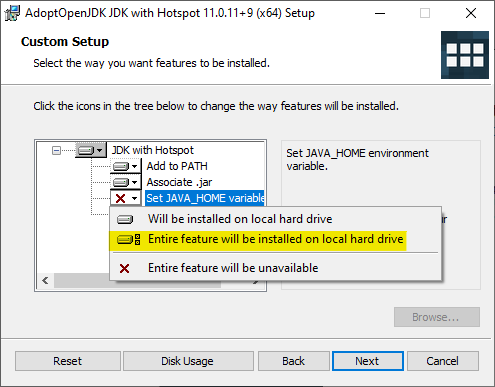
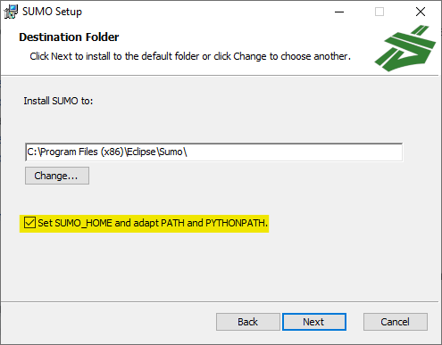

# Installation Guide

This guide describes the steps needed in order to install and configure Eclipse MOSAIC on Debian (i.e. Ubuntu) distributions, Windows, and macOS. 
It is based on the official guide found in the [webpage](https://www.eclipse.org/mosaic/docs/getting_started/).

MOSAIC requires two additional pieces of software: [Java](https://adoptopenjdk.net/?variant=openjdk16&jvmVariant=hotspot) and [SUMO](https://sumo.dlr.de/docs/Downloads.php#linux_binaries).

## Installing Java

If you have been using your computer for some time, you might already have Java installed. Type in the following terminal (*Windows Shortcut: WindowsKey, type `cmd`*) command to check: `java --version`

The output should look similar to this:

```shell
openjdk 16.0.1 2021-04-20
OpenJDK Runtime Environment AdoptOpenJDK-16.0.1+9 (build 16.0.1+9)
OpenJDK 64-Bit Server VM AdoptOpenJDK-16.0.1+9 (build 16.0.1+9, mixed mode, sharing)
```

Else, if you get an error message or something similar, you need to install Java based on the [official guide](https://adoptopenjdk.net/installation.html?variant=openjdk16&jvmVariant=hotspot):

### Linux

1. Download the latest release: [AdoptOpenJDK](https://github.com/AdoptOpenJDK/openjdk16-binaries/releases/download/jdk-16.0.1%2B9/OpenJDK16U-jdk_x64_linux_hotspot_16.0.1_9.tar.gz)
2. Create a new directory in your home-folder called **adoptopenjdk**
3. Copy/move the tarball from your download folder to **adoptopenjdk** and open a terminal in this folder
4. Extract the tarball using `tar xzf OpenJDK16U-jdk_x64_linux_hotspot_16.0.1_9.tar.gz`
5. The tarball should extract the following folder: **jdk-16.0.1+9**.
6. Open a new terminal and type in the following commands: First `cd` and then `gedit .bashrc`.
7. Insert the following line at the end: `export PATH=/home/USERNAME/adoptopenjdk/jdk-16.0.1+9/bin:$PATH`, save and exit. You can get your USERNAME using the command `whoami` in a terminal. 
8. Open a new terminal and type `java --version`. It should now be installed.

### Windows

1. Download the latest LTS release: [AdoptOpenJDK](https://github.com/AdoptOpenJDK/openjdk11-binaries/releases/download/jdk-11.0.11%2B9/OpenJDK11U-jdk_x64_windows_hotspot_11.0.11_9.msi)
2. Double click and run as administrator
3. **IMPORANT:** You need to set the environment variable **JAVA_HOME**. See next Figure:



After installation type `java --version` in the command line to check whether the installation was successful.

### macOS

1. Download the latest release: [AdoptOpenJDK](https://github.com/AdoptOpenJDK/openjdk16-binaries/releases/download/jdk-16.0.1%2B9/OpenJDK16U-jdk_x64_mac_hotspot_16.0.1_9.pkg)
2. Install the `.pkg` file just like any other application
3. Open a new terminal and type `java --version`. It should now be installed.

<div style="page-break-after: always;"></div>

## Installing SUMO

### Linux

In the terminal, type in the following commands:

```shell
sudo add-apt-repository ppa:sumo/stable
sudo apt-get update
sudo apt-get install sumo sumo-tools sumo-doc
```

Open a new terminal and run `sumo --version` to check if everything works.

### Windows

Download [SUMO](https://sumo.dlr.de/releases/1.9.2/sumo-win64-1.9.2.msi) and install as usual.

**IMPORTANT:** Don't forget to set environment variable **SUMO_HOME**:


Open a new terminal and run `sumo --version` to check if everything works.

### macOS

For macOS simply follow the [official guide](https://sumo.dlr.de/docs/Installing/index.html#macos).

Open a new terminal and run `sumo --version` to check if everything works.


<div style="page-break-after: always;"></div>

## Installing Eclipse MOSAIC

1. Download [Eclipse MOSAIC 21](https://www.dcaiti.tu-berlin.de/research/simulation/download/)
2. Extract it and open a terminal in the resulting folder (on Windows you can simply write "cmd" in the address bar to open the terminal)
3. On Linux and macOS: Type `chmod +x ./mosaic.sh`. This will make the shell script executable.
4. Type `./mosaic.sh -s Barnim -v` on Linux and macOS or `./mosaic.bat -s Barnim -v` on Windows. This should run the Barnim simulation and open the web visualizer.
5. In the terminal window you should see an output similar to this:

```shell
2021-06-08 11:10:13,981 INFO  ROOT - Running Eclipse MOSAIC 21.0 on Java JRE v16.0.1 (AdoptOpenJDK)
2021-06-08 11:10:14,271 INFO  FederationManagement - Start federation with id 'Barnim'
2021-06-08 11:10:14,271 INFO  FederationManagement - Add ambassador/federate with id 'application'
2021-06-08 11:10:14,272 INFO  FederationManagement - Add ambassador/federate with id 'environment'
2021-06-08 11:10:14,273 INFO  FederationManagement - Add ambassador/federate with id 'mapping'
2021-06-08 11:10:14,273 INFO  FederationManagement - Add ambassador/federate with id 'sns'
2021-06-08 11:10:14,273 INFO  FederationManagement - Add ambassador/federate with id 'sumo'
2021-06-08 11:10:14,273 INFO  FederationManagement - Deploying federate 'sumo' locally in ./tmp/sumo
2021-06-08 11:10:14,298 INFO  FederationManagement - Starting federate 'sumo' locally in ./tmp/sumo
2021-06-08 11:10:14,298 INFO  FederationManagement - Add ambassador/federate with id 'output'
11:10:18 - Simulating: 59000000000ns (59.0s / 1000.0s) - 5.9% (RTF:0.00, ETC:unknown)                    
11:10:20 - Simulating: 195000000000ns (195.0s / 1000.0s) - 19.5% (RTF:37.26, ETC:21.7s)                  
11:10:25 - Simulating: 555000000000ns (555.0s / 1000.0s) - 55.5% (RTF:37.26, ETC:21.7s)                 
11:10:25 - Simulating: 1000000000000ns (1000.0s) - 100.0%
11:10:25 - Duration: 00h 00m 10.008s (RTF: 99.00)
11:10:25 - Simulation finished: 101
```

**Congrats!** You successfully installed Mosaic!


<div style="page-break-after: always;"></div>

# Setting up the analysis toolbox

In order to execute experiments and analyze the results, we provide a little Python toolbox for you which you can execute using the provided Jupyter notebook. Like in the previous workshop, you need to have [Python](https://www.python.org/downloads/) installed on your machine.

## Install dependencies

To install the Python dependencies, please open a terminal in the `cid_workshop2_prep` folder and run the following:

```
pip install -r requirements.txt
```

If you have multiple Python projects installed you might want to use a [virtual environment](https://docs.python.org/3/tutorial/venv.html) to install your dependencies, however, this is not required. If you do so, take care that [the notebook kernel points to the correct venv](https://janakiev.com/blog/jupyter-virtual-envs/).


## Execute the toolbox

To start the toolbox run:

```
jupyter notebook
```

A browser window will open. Select `notebook.ipynb`.

**Congrats Again!** See if all the notebook cells run without errors and you are ready to attend the workshop!


In case of problems please feel free to contact me (muzaffer.citir@campus.tu-berlin.de).
