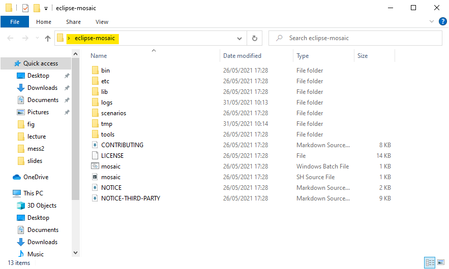

# Installation Guide for Windows 10 x64

This guide describes the steps needed in order to install and configure Eclipse MOSAIC on Windows 10 x64. It is based on the official guide found in the webpage [https://www.eclipse.org/mosaic/docs/getting_started/].

## Requirements

Essentially, MOSAIC requires two additional software, [Java](https://adoptopenjdk.net/?variant=openjdk11&jvmVariant=hotspot) and [SUMO]().

### Installing Java

If you have been using your computer for some time, you might already have Java installed. Type in the following terminal (**Shortcut: WindowsKey, type `cmd`**) command to check: `java --version`

Output should look something similar to this:

```shell
openjdk 16.0.1 2021-04-20
OpenJDK Runtime Environment AdoptOpenJDK-16.0.1+9 (build 16.0.1+9)
OpenJDK 64-Bit Server VM AdoptOpenJDK-16.0.1+9 (build 16.0.1+9, mixed mode, sharing)
```

Else, if you get an error message or something similar, you need to install Java, based on the official [guide](https://adoptopenjdk.net/installation.html?variant=openjdk16&jvmVariant=hotspot#x64_linux-jdk):

1. Download the latest LTS release: [AdoptOpenJDK](https://github.com/AdoptOpenJDK/openjdk11-binaries/releases/download/jdk-11.0.11%2B9/OpenJDK11U-jdk_x64_windows_hotspot_11.0.11_9.msi)
2. Double click and run as administrator
3. **IMPORANT:** You need to set the environment variable **JAVA_HOME**. See next Figure:


After installation type `java --version` in the command line to check whether the installation was successful.

### Installing SUMO

From [https://sumo.dlr.de/docs/Downloads.php] download [https://sumo.dlr.de/releases/1.9.2/sumo-win64-1.9.2.msi] and install as usual.

**IMPORTANT:** Don't forget to set environment variable **SUMO_HOME**:


After installation, check using `sumo --version`.

### Installing Eclipse MOSAIC

1. Download Eclipse MOSAIC 21 from [https://www.dcaiti.tu-berlin.de/research/simulation/download/]
2. Extract it in a folder
3. Open a terminal in that folder. **Hint:** You can type `cmd` in the File Explorer to open a command line in that folder, i.e.:




4. In the terminal window you should see an output similar to this:

```shell
C:\Users\ongun\Desktop\eclipse-mosaic>mosaic.bat -s Barnim -v
2021-06-29 14:19:19,923 INFO  ROOT - Running Eclipse MOSAIC 21.0 on Java JRE v11.0.11 (AdoptOpenJDK)
2021-06-29 14:19:20,255 INFO  FederationManagement - Start federation with id 'Barnim'
2021-06-29 14:19:20,257 INFO  FederationManagement - Add ambassador/federate with id 'application'
2021-06-29 14:19:20,262 INFO  FederationManagement - Add ambassador/federate with id 'environment'
2021-06-29 14:19:20,263 INFO  FederationManagement - Add ambassador/federate with id 'mapping'
2021-06-29 14:19:20,263 INFO  FederationManagement - Add ambassador/federate with id 'sns'
2021-06-29 14:19:20,264 INFO  FederationManagement - Add ambassador/federate with id 'sumo'
2021-06-29 14:19:20,265 INFO  FederationManagement - Deploying federate 'sumo' locally in .\tmp\sumo
2021-06-29 14:19:20,367 INFO  FederationManagement - Starting federate 'sumo' locally in .\tmp\sumo
2021-06-29 14:19:20,370 INFO  FederationManagement - Add ambassador/federate with id 'output'
14:19:38 - Simulating: 1000000000000ns (1000.0s) - 100.0%
14:19:38 - Duration: 00h 00m 14.686s (RTF: 68.00)
14:19:38 - Simulation finished: 101
```

**Congrats!** If you need help with problem or need troubleshooting, please feel free to contact me: [ongun.turkcuoglu@campus.tu-berlin.de]
